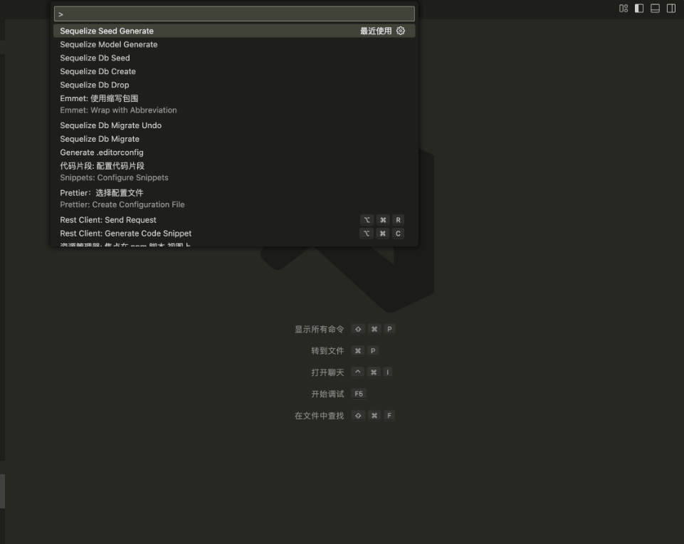

# Sequelize Cli

Run Sequelize Cli commands from within Visual Studio Code.

## Features

- Make files (Migrations, Models, Seed)
- Run Custom Commands
- Manage the database

## Seed Generate

## Requirements
